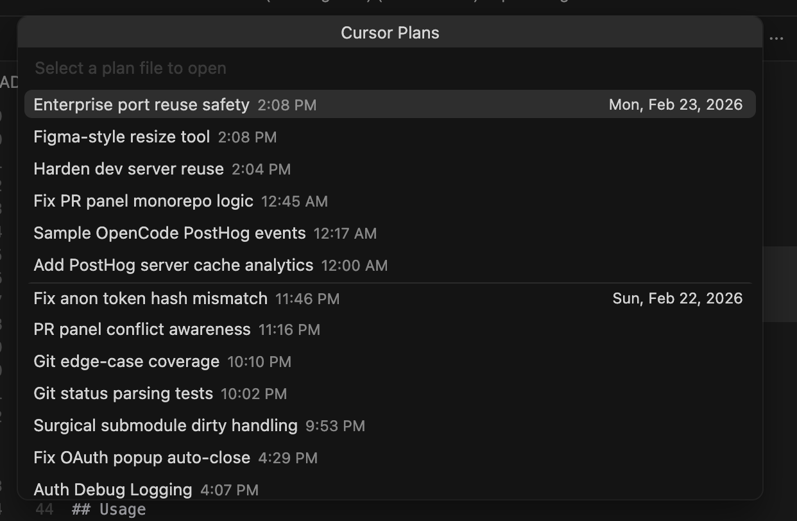

# Cursor Plans Quick Pick

A VS Code / Cursor extension that gives you fast access to your Cursor plan files. Run a single command to browse every `.plan.md` file in `~/.cursor/plans`, grouped by date, and open the one you need.

## Why This Exists

Cursor's plan mode is my daily driver, but plans are surprisingly hard to find once you create them. They're not surfaced in the UI, and there's no easy way to browse or reopen them. I kept losing plans and wasting tokens recreating context that already existed somewhere on my machine. Turns out, all plans are stored in `~/.cursor/plans` as markdown files, but opening them is a pain.

This extension is a scrappy solution. It gives you instant visibility into all your plans and lets you open them with a quick dropdown, then use Cursor to execute as usual.



## Features

- **Quick Pick list** of all plan files in `~/.cursor/plans`, sorted newest-first.
- **Date-grouped separators** so you can visually scan plans by day.
- **Smart title extraction** — displays the YAML frontmatter `name` field, the first markdown heading, or the filename as a fallback.
- **Incremental caching** — watches the plans directory for changes and applies diffs without a full rescan, so the list opens instantly even with many files.
- **Graceful error handling** — shows a friendly message if the plans directory doesn't exist yet.

## Requirements

- **Cursor** or **VS Code** `^1.95.0`
- **Node.js** (for building from source)

## Getting Started

### Quick Install (Pre-built)

A pre-built extension package is included in this repository:

1. In Cursor, open the Command Palette (`Cmd+Shift+P` / `Ctrl+Shift+P`).
2. Run **Extensions: Install from VSIX...**.
3. Select `cursor-plans-quick-pick-0.0.1.vsix` from this project directory.

The extension will be installed and ready to use.

### Development Build

If you want to build from source:

```bash
# Install dependencies
npm install

# Compile TypeScript
npm run compile
```

To run during development, press **F5** (or use the *Run Extension* launch configuration) to open an Extension Development Host with the extension loaded.

## Usage

1. Open the Command Palette (`Cmd+Shift+P` / `Ctrl+Shift+P`).
2. Run **Cursor Plans: List Plans**.
3. Pick a plan from the list — it opens in your editor.

## How It Works

The extension reads every `*.plan.md` file from `~/.cursor/plans` on first invocation, builds an in-memory index sorted by modification time, and caches the Quick Pick items. A file-system watcher (`fs.watch`) tracks adds, updates, and deletes so subsequent invocations reflect changes without a full rebuild. If the watcher reports an error, the cache falls back to a complete rescan.

## Development

| Script | Description |
|---|---|
| `npm run compile` | One-shot TypeScript compilation |
| `npm run watch` | Continuous compilation in watch mode |

The compiled output goes to `out/`. Source maps are generated for debugging.

## Project Structure

```
src/
  extension.ts   — activation, command registration, PlanIndexCache
  types.ts       — PlanRecord and PlanQuickPickItem interfaces
out/             — compiled JavaScript (generated)
.vscode/
  launch.json    — debug configuration
  tasks.json     — build tasks
```

## License

[MIT](LICENSE)
